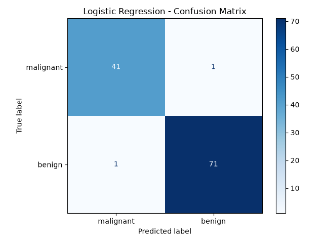
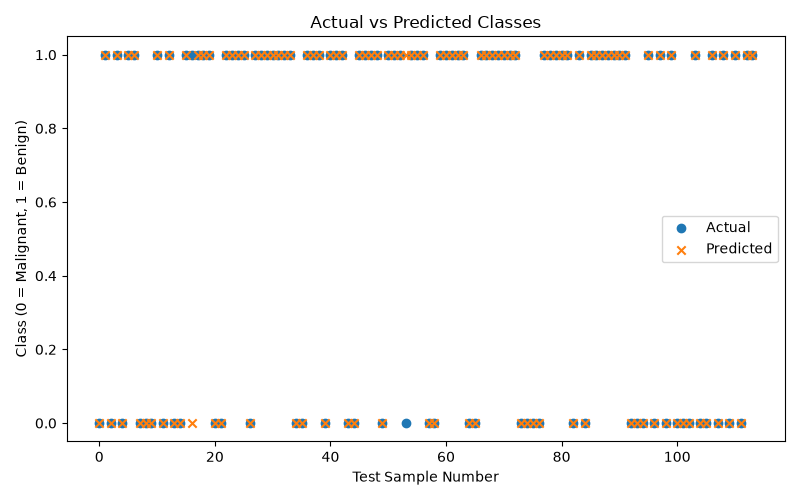

# Day 8: Logistic Regression Classification

## Objective
To implement Logistic Regression using Python and Scikit-learn to classify breast cancer tumors as malignant or benign.

## Dataset
Breast Cancer Wisconsin dataset provided by Scikit-learn.

- Total samples: 569
- Input features: 30
- Classes: Malignant and Benign

## Technologies Used
- Python
- Scikit-learn
- Matplotlib
- Pandas (not required in this implementation)

## Steps Performed
1. Loaded the Breast Cancer dataset.
2. Split the dataset into training and testing sets.
3. Scaled the features using StandardScaler.
4. Created a Logistic Regression model.
5. Trained the model using training data.
6. Predicted tumor classes for the test data.
7. Evaluated the model using accuracy, precision, recall, and F1-score.
8. Visualized the results using graphs.

## Model Results
- Training samples: 455
- Testing samples: 114
- Accuracy: 98.25%

## Visualizations

### 1. Confusion Matrix
The confusion matrix shows the number of correct and incorrect predictions for each class.

### 2. Actual vs Predicted Classes
This graph compares the actual classes with the classes predicted by the model.

## Key Learnings
- Understood Logistic Regression for classification.
- Learned why feature scaling is important.
- Practiced training and testing a machine learning model.
- Evaluated classification performance using multiple metrics.
- Created visualizations to understand model predictions.

## Conclusion
The Logistic Regression model achieved 98.25% accuracy on the test dataset. This practical exercise helped demonstrate binary classification and model evaluation using Scikit-learn.

Note: This project is for educational purposes only and is not a medical diagnostic tool.
